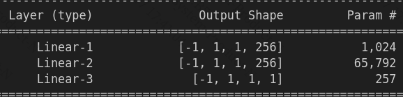
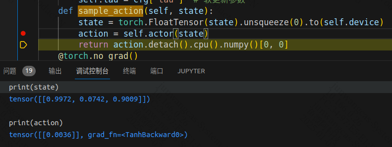

### Actor

summary(my_actor, (1,1,3))



在sample_action()中，有如下数据：



### update()

```
if len(self.memory) < self.batch_size: # 当memory中不满足一个批量时，不更新策略
            return
```

一开始玩儿的时候，回放系统中数据还不够，就直接略过

```
# 从经验回放中中随机采样一个批量的transition
        state, action, reward, next_state, done = self.memory.sample(self.batch_size)
```

这个sample，采用的是随机采样。

### ReplayBuffer

存储系统状态用的。 SPAR 都放在这里。

有两个接口，一个push，一个sample

```
agent.memory.push((state, action, reward, next_state, done))
```

有了这些信息，可以把系统回放出来。

随着系统的演进，这个里面的数据，是不清空的，一直增加。

### critic

```
actor_loss = self.critic(state, self.actor(state))
```

输入是state，以及动作