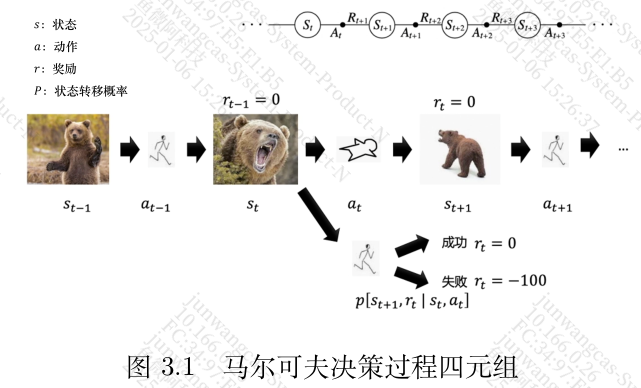
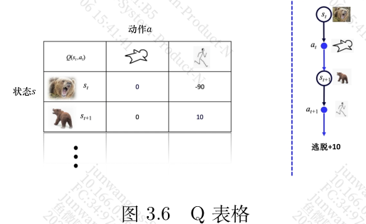
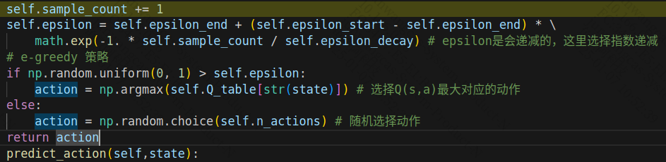
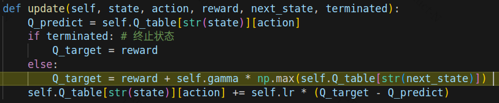

chap3 表格型方法

表格型方法是不是就是查表，比如现在状态是啥样儿的，查个表，然后执行？

### 3.1 马尔科夫决策过程

这个熊，有点意思哦，为什么不是牛。还有就是跑不跑



（SAPR）-  改个名字吧，叫spa

#### 3.1.1 有模型

如果已知环境的状态转移概率，那这个g就是已知。 那这个是不可能的。因为rx是无法预测的。
#### 3.1.2 免模型

环境是未知的，每次的熊，都是不一样的。

#### 3.1.3 有模型与免模型的区别

### 3.2 Q表格


### 3.3 免模型预测

#### 3.3.1 蒙特卡洛策略评估

这里的策略$\pi$, 比如就如上一节中说到的“向上”，

```
蒙特卡洛仿真是指我们可以采样大量的轨迹，计算所有轨迹的真实回报，然后计算平均值。蒙特卡洛
方法使用经验平均回报（empirical mean return）的方法来估计
```

就是把所有case都试一下。

#### 3.3.2 时序差分

时序差分不需要了解，他可以在线学习，回合没有结束也可以。

### 3.4 免模型控制

### 3.5 使用Q学习解决悬崖寻路问题

#### Q and A

- [x] 1. 每一个回合怎么结束； 到达终点；
- [x] 2. Q table中，每个数值是什么
- [x] 3. 训练过程中，每一个回合有多少步
- [x] 4. 如何判断收敛

2. 本质就是reward
3. 最多200步
4. 看最后的reward是否趋于稳定


#### choose action

```
前文讲到智能体在整个训练中只做两件事，一是选择动作，一是更新策略
```



这里的贪婪，说的就是按照q表去查找，依赖以前的经验。

这里的逻辑是，一开始是更偏向于随机，后来慢慢更多得用Q_table来查找

#### Update



|                                  | 第一步 | 第二步 |
| -------------------------------- | ------ | ------ |
| state                            | 36     | 24     |
| action                           | 0      | 0      |
| reward                           | -1     | -1     |
| next_state                       | 24     | 12     |
| terminated                       | False  | False  |
| Q_predict                        | 0      | 0      |
| Q_target                         | -1     | -1     |
| self.lr * (Q_target - Q_predict) | -0.1   | -0.1   |

这样一步步走，因为每一步走得好不好都能评估出来，那基本上就没问题了。

在实际操作中，可能复杂的在于state的定义，就是环境更复杂，而不是简简单单的一个一维数字了。

整个算法有点像最短路径算法。

```
这个函数实现了Q-learning的核心更新公式：
Q(s,a)：当前状态-动作对的Q值（代码中的Q_predict）
α：学习率（代码中的self.lr）
r：即时奖励（代码中的reward）
γ：折扣因子（代码中的self.gamma）
目标Q值（代码中的Q_target）
特别说明：
对于终止状态，目标Q值直接等于奖励值，因为终止状态后没有未来奖励
对于非终止状态，目标Q值是即时奖励加上下一状态最大Q值的折扣
学习率lr控制更新步长，折扣因子gamma权衡即时和未来奖励的重要性
这是一个时序差分（TD）学习方法，用实际收到的奖励和对未来的估计来更新当前的估计
这个更新规则让智能体能够：
从经验中学习
考虑长期回报
逐步优化其决策策略
```


