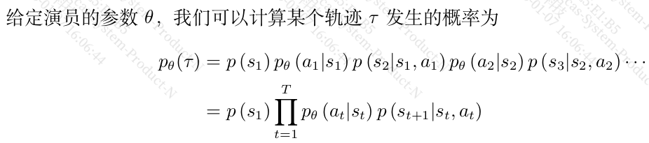
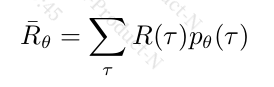
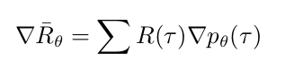

### 4.1 策略梯度算法



这里环境是与参数无关的，所以与$\theta$无关



给定一组$\theta$, 那么不同路径下可能获得的奖励的期望是可以计算出来的。



对于一个轨迹，他的奖励是确定，所以他与参数$\theta$ 无关。这里可以把他当成常数，甚至简单起见，我们可以把他设置为1

```
我们要最大化期
望奖励。因为我们要让奖励越大越好，所以可以使用梯度上升（gradient ascent）来最大化期望奖励。
```

```
我们可在 PyTorch 里调用现成的函数来自动计算损失函数，并且把梯度计算出来。这是一般的分类
问题，强化学习与分类问题唯一不同的地方是损失前面乘一个权重——整场游戏得到的总奖励 R(τ )，而不是在状态 s 采取动作 a 的时候得到的奖励
```


采用策略梯度时，与分类问题是有相同点的。