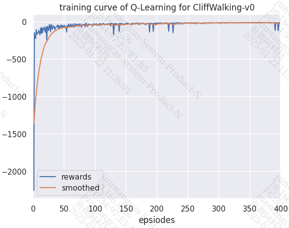
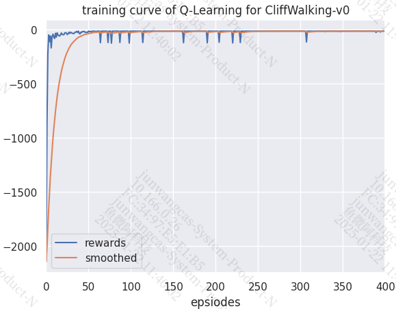

##### learning rate

###### 0.1



```
回合：20/400，奖励：-125.0，Epsilon：0.010
回合：40/400，奖励：-47.0，Epsilon：0.010
回合：60/400，奖励：-70.0，Epsilon：0.010
回合：80/400，奖励：-45.0，Epsilon：0.010
回合：100/400，奖励：-45.0，Epsilon：0.010
回合：120/400，奖励：-41.0，Epsilon：0.010
回合：140/400，奖励：-128.0，Epsilon：0.010
回合：160/400，奖励：-44.0，Epsilon：0.010
回合：180/400，奖励：-26.0，Epsilon：0.010
回合：200/400，奖励：-17.0，Epsilon：0.010
回合：220/400，奖励：-128.0，Epsilon：0.010
回合：240/400，奖励：-17.0，Epsilon：0.010
回合：260/400，奖励：-13.0，Epsilon：0.010
回合：280/400，奖励：-16.0，Epsilon：0.010
回合：300/400，奖励：-13.0，Epsilon：0.010
回合：320/400，奖励：-13.0，Epsilon：0.010
回合：340/400，奖励：-13.0，Epsilon：0.010
回合：360/400，奖励：-13.0，Epsilon：0.010
回合：380/400，奖励：-13.0，Epsilon：0.010
回合：400/400，奖励：-13.0，Epsilon：0.010
```

###### 0.5



```
回合：20/400，奖励：-43.0，Epsilon：0.012
回合：40/400，奖励：-34.0，Epsilon：0.010
回合：60/400，奖励：-24.0，Epsilon：0.010
回合：80/400，奖励：-13.0，Epsilon：0.010
回合：100/400，奖励：-13.0，Epsilon：0.010
回合：120/400，奖励：-13.0，Epsilon：0.010
回合：140/400，奖励：-13.0，Epsilon：0.010
回合：160/400，奖励：-13.0，Epsilon：0.010
回合：180/400，奖励：-13.0，Epsilon：0.010
回合：200/400，奖励：-13.0，Epsilon：0.010
回合：220/400，奖励：-13.0，Epsilon：0.010
回合：240/400，奖励：-13.0，Epsilon：0.010
回合：260/400，奖励：-13.0，Epsilon：0.010
回合：280/400，奖励：-13.0，Epsilon：0.010
回合：300/400，奖励：-13.0，Epsilon：0.010
回合：320/400，奖励：-13.0，Epsilon：0.010
回合：340/400，奖励：-13.0，Epsilon：0.010
回合：360/400，奖励：-13.0，Epsilon：0.010
回合：380/400，奖励：-13.0，Epsilon：0.010
回合：400/400，奖励：-13.0，Epsilon：0.010
```

##### 其他

自己定义的部分，agent。

```
agent
sample_action -- 训练时用
predict_action -- 测试时用
update -- 更新Q表
```

就是这三大部分，其他的reward是环境自动生成的。

比如衡量 reward，这个本来就是确定的，不需要自己调整。你也更改不了。

##### predict_action

```
''' 预测或选择动作，测试时用
        '''
action = np.argmax(self.Q_table[str(state)])
```

直接算出概率最大的动作。

