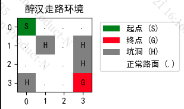
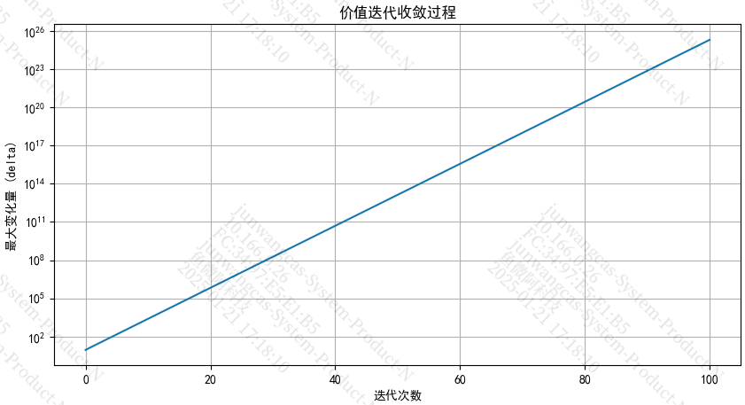

##### 遗留的问题

- [ ] 把迭代过程中Q的变化量画出来，发现不是逐步下降的，反而是逐步提升的，说明这个算法代码有问题

##### 流程

 value iteration

作者现在在搞llm去了，上海ai lab



当醉汉在14的时候，给出向右走的指令，那么状态转移概率如下：

```
state = 14  # 起始状态
action = 2  # 向右移动

print(f"在状态 {state} 采取动作 {action} 可能的转移：")
for prob, next_state, reward, done in env.P[state][action]:
    print(f"概率: {prob}")
    print(f"下一个状态: {next_state}")
    print(f"奖励: {reward}")
    print(f"是否结束: {done}")
    print("---")
```

结果如下：

```
在状态 14 采取动作 2 可能的转移：
概率: 0.8
下一个状态: 15
奖励: 10
是否结束: True
---
概率: 0.1
下一个状态: 14
奖励: -0.0
是否结束: False
---
概率: 0.1
下一个状态: 10
奖励: -0.0
是否结束: False
```

这个状态转移

对应到这里，这三种情况分别是：

```
for prob, next_state, reward, done in env.P[state][a]:
    accum += prob* np.max(Q[next_state, :])
    reward_total += prob * reward
```

```
accum += 0.8 * np.max(Q[15, :])
reward_total += 0.8 * 10
accum += 0.1 * np.max(Q[14, :])
reward_total += 0.1 * 0
accum += 0.1 * np.max(Q[10, :])
reward_total += 0.1 * 0
```

但是这里有个问题，Q的初始化都是0，也就是说accum 与 reward total都是0.

实验，accum并不是都是0. 明白了，reward_total每次都是加进去的。

reward_total 记录的是这个动作执行下去，所有产生的回报（下一步的）

##### 问题



这个价值迭代应该是逐步减少的，为啥这里是逐步增大的，而且似乎是线性的。

说明这个代码还是有点问题的。


